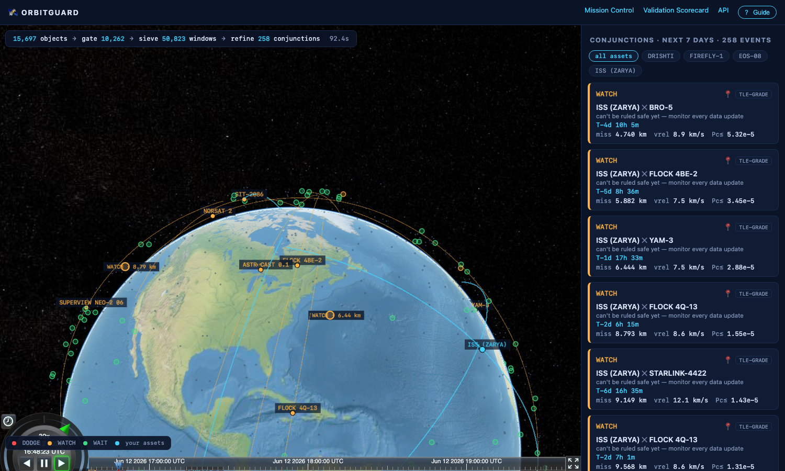

# 🛰 OrbitGuard

**Free, explainable, *validated* satellite conjunction screening for small operators.**

A university cubesat team gets a collision warning email: cryptic format, ~99% false-alarm base
rate, and the tools that decode it cost more than their satellite. OrbitGuard is what they should
have instead — a browser-based conjunction-assessment system built entirely on public data, with
the actual operational math, and an accuracy story it can prove rather than assert.

> FAR AWAY 2026 · Space & Aerospace track · built by a 4–5 person team on a $0 budget



## What it does

- **Screens your satellites against the full public catalog** (15,000+ active objects from
  CelesTrak GP, OMM JSON) for close approaches over a 7-day window — in seconds on a laptop.
- **Computes collision probability with the operational method**: Foster (1992) 2D
  encounter-plane integration, cross-checked by the Chan (1997) analytic series, the same
  approach NASA CARA runs.
- **Refuses to lie when the data can't support a number.** GP/TLE data carries no covariance, so
  OrbitGuard computes the *worst-case* Pc bound over all consistent error models
  (PcMax = R²/(e·d²)) — which can **prove an event safe, but never justify a maneuver**.
- **Issues an explained DODGE / WAIT / WATCH verdict** anchored to NASA CA Handbook thresholds,
  every one carrying its full numeric evidence record.
- **Narrates each verdict in plain language** via a strictly-grounded LLM layer (Groq,
  llama-3.3-70b): the model receives an already-final JSON evidence record and may not introduce
  a single number of its own — a post-validator rejects any output whose digits aren't in the
  record and falls back to a deterministic template.
- **Renders it all on a live 3D globe** (CesiumJS): animated assets, conjunction markers,
  encounter-plane plots, countdowns to TCA.

## The screening funnel (a real run)

```
15,697 objects ──gate──▶ 834 ──sieve──▶ 1,967 windows ──refine──▶ 7 conjunctions    11.6 s
                (ISS vs full catalog, 7-day window, M-series laptop)
```

1. **Stage A — apogee/perigee gate** (Hoots Filter I): altitude bands that can't intersect within
   the padded screening distance are discarded, O(N).
2. **Stage B — padded coarse-grid sieve**: vectorized SGP4 (`SatrecArray`) on a 30 s grid; a pair
   is kept if it comes within `D + v_rel,max·Δt/2 ≈ 244 km`. **This pad is a guarantee, not a
   heuristic** — no true sub-D conjunction can evade the coarse net (Alarcón-Rodríguez et al.
   2002, the "smart sieve" ESA built CRASS on).
3. **Stage C — TCA refinement**: Brent root-finding on g(t) = Δr·Δv to millisecond-level TCA,
   then miss distance, relative velocity, and radial/in-track/cross-track decomposition.

## Why you can trust the numbers

This project's thesis is that **accuracy should be measured, not asserted**:

| Claim | How it's verified (in CI, today) |
|---|---|
| The sieve misses nothing | Property test: full pipeline output is compared against a **brute-force 1-second search over every pair** — recall *and* precision, on scenes with planted conjunctions, near-misses, GEO/Molniya decoys |
| Foster Pc is exact | Matches the closed-form noncentral-χ² result (isotropic case) to 1e-6 relative, and an **independent adaptive 2D quadrature referee** to machine precision; Monte Carlo (2M samples) agrees within sampling error |
| Chan cross-check | Exact-isotropic cases match to 1e-9; anisotropic disagreement bounded and documented (it's the approximate method — Foster is the reference) |
| PcMax is a theorem, not a guess | CI sweeps σ across four decades and verifies the exact Pc never exceeds R²/(e·d²), and that the bound is *attained* at σ = d/√2 |
| Propagation & frames are right | Cross-checked against Skyfield's independent TEME→GCRS pipeline to **< 5 m**; TEME/UTC handling routed through one audited module |
| Validation harness is correct | Synthetic ephemerides with closed-form TCA/miss answers; answer-key matcher scores duplicates against precision |

**The federal exam.** The harness in `engine/validation/` runs our screening directly on the
official U.S. **TraCSS "Dataset for Conjunction Assessment Verification"** (20.7 GB of CCSDS-OCM
ephemerides + a 913,330-conjunction answer key generated by The Aerospace Corporation's validated
CSieve tool, CC0) — all-vs-all over ~24,000 objects, 7 days, executed in memory-bounded time
slices on an 8 GB laptop. Results live in `data/scorecard.json` and on the in-app scorecard —
*we publish what we measure, not what we hope.*

```bash
# one-time: parse OCMs into an .npy cache (incremental, parallel)
python -m engine.validation.tracss_harness convert --eph-dir <dataset> --cache-dir <ssd>/npy_cache
# screen (slice ranges can run as concurrent processes), then score
python -m engine.validation.tracss_harness run   --cache-dir <ssd>/npy_cache --events-out ev.json
python -m engine.validation.tracss_harness score --events ev.json \
    --key data/tracss/IVV_Releasable_Dataset_Spherical_DefaultHBR.csv.gz --out data/scorecard.json
```

## What the LLM is *not* doing

Propagation, screening, TCA, probability, and policy are pure physics/numerics. The LLM converts
one finished JSON record into prose, under a validator that rejects hallucinated numbers, with a
template fallback so a Groq outage can't break anything. OrbitGuard is not an AI wrapper — it is
a numerical pipeline with an explanation layer bolted on the *end*.

## Honest limits (also shown in-app)

- GP/TLE accuracy is ~1 km at epoch, degrading 1–3 km/day (in-track dominant). That is why
  TLE-grade verdicts are bounds, and why "request a CDM" is an explicit escalation path.
- Low relative-velocity encounters (< 100 m/s) violate the short-encounter 2D-Pc assumptions;
  OrbitGuard flags them "2D-Pc not applicable" instead of printing a wrong number.
- The TraCSS dataset is for algorithm testing, not operational certification (per the Office of
  Space Commerce) — and a hackathon project is not an operational CA service.

## Architecture

```
CelesTrak GP (OMM JSON) ─┐
Space-Track CDMs (stretch)─┤─▶ ingest ─▶ astro (SGP4/frames) ─▶ screening (A/B/C) ─▶ risk
TraCSS ephemerides ───────┘      │                                                  (Foster/Chan/
                                 ▼                                                   PcMax/policy)
                          validation harness                                            │
                          (answer-key scoring)                                          ▼
                                                  FastAPI ◀── evidence records ◀── explain (Groq,
                                                     │                              narrate-only)
                                                     ▼
                                    Next.js + CesiumJS (globe · inspector · scorecard)
```

OMM-first throughout: catalog IDs are integers end-to-end (the 5-digit TLE field exhausts at
69999 ≈ July 2026; legacy-TLE pipelines break this summer — ours won't). Our own demo asset
DRISHTI is NORAD 69010.

## Quickstart

```bash
# engine
cd orbitguard
python3.13 -m venv .venv && .venv/bin/pip install -e ".[dev]"
.venv/bin/pytest                          # 43 tests
.venv/bin/python -m engine.cli fetch      # one disciplined CelesTrak download (2 h cache)
.venv/bin/python -m engine.cli screen --assets 25544 --days 7 --explain

# API + web
.venv/bin/uvicorn engine.api.app:app --port 8000
cd web && npm install && npm run dev      # http://localhost:3000
```

Works fully offline after the first fetch (committed fixture + NaturalEarthII imagery — no API
keys, no ion token). `GROQ_API_KEY` in `.env` upgrades explanations from template to LLM prose.

Demo assets: **ISS** (25544), **Pixxel FIREFLY-1** (62701), **GalaxEye DRISHTI** (69010),
**ISRO EOS-08** (60454) — the Indian smallsat ecosystem that commercial SSA prices out.

## Repository map

```
engine/ingest      CelesTrak fetcher — cache discipline enforced in code, not convention
engine/astro       OMM→Satrec, vectorized SGP4, the single audited frames module
engine/screening   Stage A gate · Stage B padded sieve · Stage C Brent TCA · funnel
engine/risk        Foster · Chan · PcMax · encounter plane · DODGE/WAIT/WATCH policy
engine/explain     Groq client · narrate-only prompt · digit validator · template fallback
engine/validation  Lagrange ephemeris interpolation · screening-on-ephemerides · key matcher
engine/api         FastAPI (the frozen OpenAPI contract)
web/               Next.js 14 + CesiumJS: Mission Control, Encounter Inspector, Scorecard
tests/             the verification core — see "Why you can trust the numbers"
docs/              ALGORITHMS.md (the math) · VALIDATION.md (the methodology)
```

## References (abridged)

Foster & Estes 1992 (NASA JSC-25898) · Chan 1997/2008 · Hejduk, NASA CARA 2D-Pc recommendations
(NTRS 20190028900) · Alarcón-Rodríguez et al. 2002 (ESA smart sieve) · Hoots et al. 1984 ·
Vallado et al. 2006 (Revisiting Spacetrack Report #3) · NASA CA Handbook v2 2023 (NTRS
20230002470) · Office of Space Commerce, Dataset for Conjunction Assessment Verification ·
CelesTrak GP data formats. Full list: `docs/ALGORITHMS.md`.

---

*Built for FAR AWAY 2026. Free and open source, for the operators commercial SSA leaves behind.*
